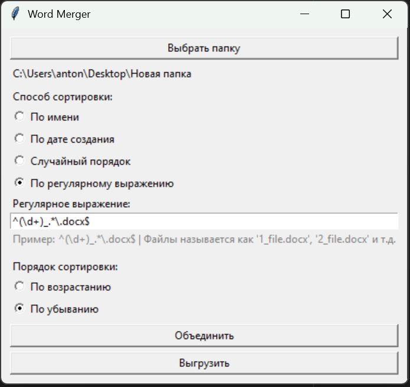

# Инструкция по использованию приложения WordMerger



## 1. Назначение приложения

Приложение **WordMerger** предназначено для объединения нескольких документов Microsoft Word (`.docx`) из одной папки в **один итоговый документ**.
Объединение выполняется в заданном порядке, с возможностью сортировки и использованием регулярных выражений.
Каждый исходный файл в итоговом документе начинается **с новой страницы**.

## 2. Запуск приложения

1. Дважды нажмите на файл **WordMerger.exe**.
2. Откроется графическое окно приложения.

## 3. Выбор папки с документами

1. Нажмите кнопку **«Выбрать папку»**.
2. В появившемся окне выберите папку, в которой находятся файлы `.docx`.
3. После выбора путь к папке отобразится в окне приложения.

Важно:

* Приложение обрабатывает **только файлы с расширением `.docx`**.
* Все файлы берутся **из одной выбранной папки**.

## 4. Выбор способа сортировки

В блоке **«Способ сортировки»** необходимо выбрать, в каком порядке документы будут объединяться.

Доступны следующие варианты:

### 4.1 По имени файла

Файлы сортируются по названию (алфавитно).

Пример:

```
01_intro.docx
02_body.docx
03_appendix.docx
```

### 4.2 По дате создания

Файлы сортируются по дате создания в файловой системе.

Подходит, если документы создавались последовательно и не переименовывались.

### 4.3 Случайный порядок

Файлы объединяются в случайном порядке.

Примечание:
Порядок сортировки (возрастание / убывание) в этом режиме не применяется.

### 4.4 По регулярному выражению

Файлы сортируются на основе **числового или текстового фрагмента**, извлекаемого из имени файла с помощью регулярного выражения.

При выборе этого режима становится активным поле **«Регулярное выражение»**.

## 5. Использование регулярного выражения

### 5.1 Что такое регулярное выражение

Регулярное выражение — это шаблон, который описывает структуру имени файла и позволяет извлечь из него ключ для сортировки.

Приложение использует **первую захватывающую группу** (круглые скобки `(...)`) в выражении для определения порядка файлов.

### 5.2 Регулярное выражение по умолчанию

По умолчанию в поле уже указано выражение:

```
^(\d+)_.*\.docx$
```

Оно подходит для файлов вида:

```
1_name.docx
2_name.docx
10_name.docx
```

Расшифровка:

* `(\d+)` — число в начале имени файла (используется для сортировки)
* `_` — символ подчёркивания
* `.*` — произвольное название
* `.docx` — расширение файла

### 5.3 Примеры других шаблонов

#### Формат: `01_intro.docx`

```
^(\d+)_.*\.docx$
```

#### Формат: `part_3_text.docx`

```
^part_(\d+)_.*\.docx$
```

#### Формат: `chapter-12.docx`

```
^chapter-(\d+)\.docx$
```

### 5.4 Важное правило

Если в выбранной папке есть файл, **который не соответствует регулярному выражению**, приложение выдаст ошибку и объединение не будет выполнено.

Это сделано намеренно, чтобы избежать некорректного порядка документов.

## 6. Порядок сортировки (возрастание / убывание)

В блоке **«Порядок сортировки»** можно выбрать направление сортировки:

* **По возрастанию**
  Пример: `1 → 2 → 10`

* **По убыванию**
  Пример: `10 → 2 → 1`

Этот параметр применяется ко всем режимам сортировки, кроме случайного порядка.

## 7. Объединение документов

После выбора папки и параметров:

1. Нажмите кнопку **«Объединить»**.
2. Приложение:

   * отсортирует файлы согласно выбранным параметрам
   * объединит документы
   * вставит разрыв страницы между файлами

При успешном выполнении появится сообщение о количестве объединённых файлов.

## 8. Сохранение результата

1. Нажмите кнопку **«Выгрузить»**.
2. В появившемся окне выберите папку и имя итогового файла.
3. Нажмите **«Сохранить»**.

Результат будет сохранён в формате `.docx`.

## 9. Возможные ошибки

### Файл не соответствует регулярному выражению

Причина:

* имя одного или нескольких файлов не подходит под заданный шаблон

Решение:

* переименовать файлы
* либо изменить регулярное выражение

### В папке нет файлов `.docx`

Причина:

* выбрана неверная папка
* файлы имеют другое расширение